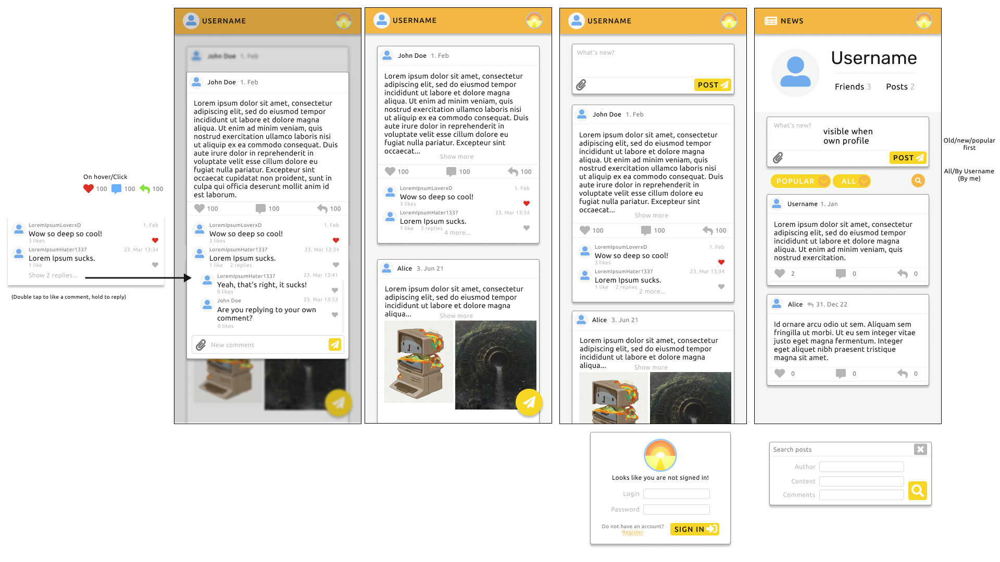
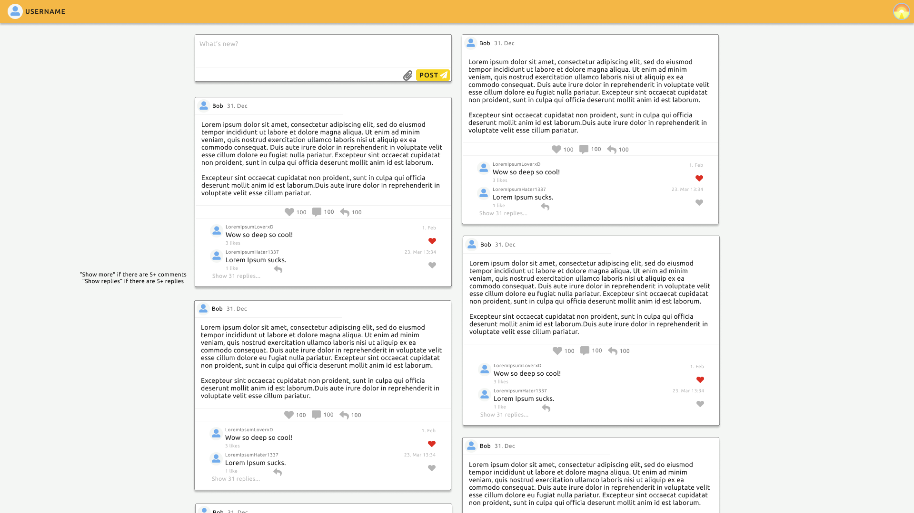

# SolarCircle

A social media web app. My goal is to create a minimalistic project for my portfolio that shows UI/UX, Frontend, and Backend knowledge.

## Goals

- User registration and authentication
- User profile and following others
- Post creation and reactions
  - Like, comment, repost, display their count
  - Comment display and hierarchy
- News feed made of posts from followed users
- Post pagination and caching
- Post search and filtering
- Access management for unauthorized users

## Techstack

- **React (TypeScript)** - frontend
- **Storybook** - UI component documentation
- **NextJS** - SSR, routing
- **Redux Toolkit** - state management
- **OAuth** - authorization
- **Jest** - unit tests
- **C#.NET** - backend
- **GraphQL** - API
- **MongoDB** - database

## UI Concepts

